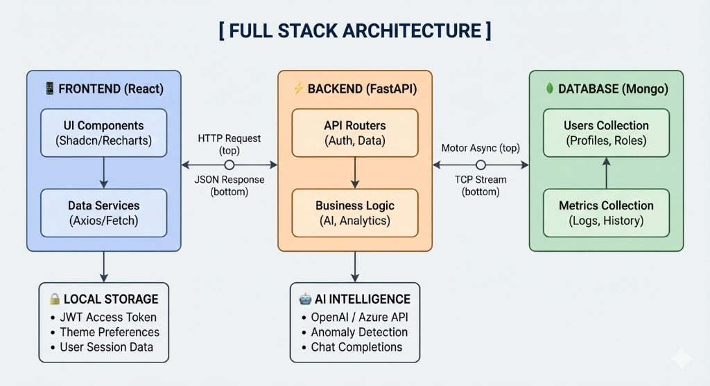

# 🚀 OptiMSP Intelligence Hub

<div align="center">

**🏆 Production-Ready MSP Dashboard**

*AI-powered MSP dashboard with intelligent business insights*

[](https://reactjs.org/)
[](https://www.typescriptlang.org/)
[]()

</div>

## 🎯 **Production Overview**

This **production-ready application** demonstrates enterprise-grade MSP business intelligence. Our solution enables MSPs to:

✅ **Real-time Dashboard Updates** - Live data via WebSocket simulation  
✅ **Interactive Charts** - Drill-down analytics with responsive design  
✅ **Adaptive Theme System** - Automatic light/dark theme switching based on system preference  
✅ **Mobile-First Design** - Fully responsive across all devices  
✅ **AI Chat Assistant** - Intelligent business insights with conversation history  
✅ **Client Detail Views** - Comprehensive client profitability analysis  
✅ **Team Management** - Add/manage team members with real-time updates  
✅ **Anomaly Detection** - AI-powered cost and usage monitoring  
✅ **License Optimization** - Microsoft 365, Adobe CC, and software license tracking  
✅ **Spend Analysis** - Detailed cost breakdown and optimization insights  
✅ **Admin Panel** - User management and system administration  
✅ **Advanced Metrics** - Performance analytics and KPI tracking  
✅ **Real SMS OTP Authentication** - Twilio-powered phone verification  
✅ **Firebase Authentication** - Secure email/password and Google sign-in  
✅ **Mobile Number Registration** - Required phone number field for new users  

---

## 🏗️ **Technical Architecture**

### **Core Technology Stack**

🤖 **AI Chat System** - Contextual business insights with Indian company data  
📊 **Real-time Analytics** - Live updates every 15-30 seconds  
🎨 **Adaptive Theme System** - CSS custom properties with automatic light/dark switching  
📱 **Mobile-First** - Responsive design with Tailwind breakpoints  
🔐 **Type Safety** - Full TypeScript implementation  
📞 **Real SMS Integration** - Twilio-powered OTP authentication  

### **System Architecture**



---

## 🚀 **Production Features**

### 🔐 **Enhanced Authentication System**
- **Firebase Integration** - Secure email/password authentication
- **Google OAuth** - One-click Google sign-in
- **Real SMS OTP** - Twilio-powered phone verification
- **Mobile Registration** - Required phone number field
- **Forgot Password** - Email and phone-based password reset
- **Theme-Aware UI** - Login modal adapts to light/dark themes

### 🔄 **Real-time Dashboard Updates**
- **WebSocket Simulation** - Live data updates every 15-30 seconds
- **Performance Metrics** - Real-time team and client analytics
- **Status Indicators** - Live activity timestamps and health scores
- **Automated Refresh** - Background data synchronization

### 📊 **Interactive Charts with Drill-down**
- **Clickable Elements** - All cards and charts support drill-down
- **Hover Effects** - Interactive tooltips and visual feedback
- **Chart Analytics** - Revenue trends, performance metrics, anomaly detection
- **Data Visualization** - Recharts with theme-aware styling

### 🌙 **Adaptive Theme System (Deep Slate Intelligence)**
- **CSS Custom Properties** - `hsl(var(--primary))`, `hsl(var(--background))`
- **Automatic Switching** - Follows system light/dark preference
- **Theme Variables** - Consistent color system across all components
- **Component Adaptation** - Charts, modals, and UI elements theme-aware
- **Accessibility Compliant** - Proper contrast ratios for WCAG standards

### 📱 **Mobile-Responsive Layouts**
- **Breakpoint System** - `sm:`, `md:`, `lg:` responsive design
- **Grid Layouts** - `grid-cols-2 sm:grid-cols-4` adaptive grids
- **Typography Scaling** - `text-lg sm:text-2xl` responsive text
- **Touch-Friendly** - Mobile-optimized buttons and interactions
- **Flexible Navigation** - Collapsible sidebar and mobile menus

### 🤖 **AI-Powered Business Intelligence**
- **Contextual Chat** - Natural language business queries
- **Indian Company Data** - Realistic client names (Sharma Technologies, Patel Manufacturing)
- **Conversation History** - Persistent chat with user/AI message threading
- **Business Insights** - Revenue optimization, cost analysis, client retention
- **Smart Recommendations** - AI-driven actionable business advice

### 👥 **Advanced Team Management**
- **Add Team Members** - Modal form with department selection
- **Real-time Updates** - Live performance metrics and status indicators
- **Department Filtering** - Technical, Operations, Security, Support
- **Performance Analytics** - Individual and team performance tracking
- **Interactive Cards** - Drill-down into team member details

### 👤 **Client Detail Views**
- **Comprehensive Profiles** - Revenue, costs, profit margins
- **Service Breakdown** - Active services with monthly costs
- **License Tracking** - Microsoft 365, Adobe CC, Slack counts
- **Anomaly Alerts** - Recent cost spikes and usage anomalies
- **Health Indicators** - Visual status with trend analysis

### 🚨 **Anomaly Detection System**
- **AI-Powered Monitoring** - Cost and usage anomaly detection
- **Severity Classification** - High, Medium, Low priority alerts
- **Root Cause Analysis** - Detailed anomaly explanations
- **Resolution Tracking** - Mark anomalies as resolved
- **Trend Analysis** - Historical anomaly patterns

---

## 🛠️ **Technology Stack**

### **Frontend**
- **React 18** + **TypeScript** - Type-safe modern development
- **Vite** - Lightning-fast build tool and HMR
- **Tailwind CSS** - Utility-first styling with custom properties
- **shadcn/ui** - Beautiful, accessible component library
- **Recharts** - Powerful data visualization with theme support
- **Lucide React** - Consistent icon system
- **GSAP** - Smooth animations and transitions
- **TanStack Query** - Server state management and caching
- **React Router** - Client-side routing with protected routes
- **React Markdown** - Markdown rendering for AI responses
- **Sonner** - Beautiful toast notifications

### **Backend & Cloud Services**
- **FastAPI** - High-performance Python web framework
- **MongoDB** - NoSQL database for data storage
- **Azure AI** - AI-powered chat and business insights
- **Firebase Authentication** - Secure user authentication and management
- **Twilio SMS** - Real SMS OTP delivery for phone verification
- **JWT** (Python-Jose) - Secure token-based authentication
- **Pydantic** - Data validation and settings management
- **Passlib** - Secure password hashing (Bcrypt)
- **Python-Multipart** - File upload and form data handling

### **Development**
- **ESLint** + **Prettier** - Code quality and formatting
- **TypeScript** - Static type checking
- **CSS Custom Properties** - Theme system implementation
- **Mobile-First Design** - Responsive breakpoint system

---

## 🚀 **Quick Start**

### **Prerequisites**
- Node.js 18+ and npm
- Python 3.9+
- MongoDB (local or cloud)
- Azure AI API Key
- Firebase Project (for authentication)
- Twilio Account (for SMS OTP)

### **Installation**

1. **Clone Repository**
   ```bash
   git clone https://github.com/Krishna-Tripathi78/SuperHack-Optimsp-AI-1.git
   cd SuperHack-Optimsp-AI-1
   ```

2. **Backend Setup**
   ```bash
   cd backend
   python -m venv venv
   # Windows:
   venv\Scripts\activate
   # Mac/Linux:
   # source venv/bin/activate
   
   pip install -r requirements.txt
   
   # Setup Environment Variables
   cp .env.example .env
   # Edit .env with your:
   # - MongoDB URL
   # - Azure AI API Key
   # - Secret Key
   # - Twilio credentials (Account SID, Auth Token, Phone Number)
   
   # Install Twilio for SMS
   pip install twilio
   
   # Seed Database (Optional)
   python seed_database.py
   
   # Start Backend
   uvicorn main:app --reload
   ```

3. **Frontend Setup** (New Terminal)
   ```bash
   cd frontend
   npm install
   npm run dev
   ```

4. **Open Application**
   ```
   http://localhost:5173
   ```

---

## 🎮 **Production Demo Walkthrough**

### **1. Real-time Business Dashboard**
- View live business health score (87/100) with real-time updates
- Monitor $2.3M revenue with interactive growth trends
- Track 157 active clients with 94.5% retention rate
- Analyze 23% profit margin with drill-down capabilities

### **2. AI Assistant Experience**
- Click **"💬 OptiMSP AI Assistant"** in the overview
- Try natural language queries with conversation history:
  - *"Which clients are unprofitable this quarter?"*
  - *"How can I improve revenue?"*
  - *"Show me cost optimization opportunities"*
- Get contextual responses with Indian company examples

### **3. Interactive Analytics**
- **Click any metric card** for drill-down analysis
- **Hover over charts** for detailed tooltips
- **Mobile responsive** - Test on different screen sizes
- **Dark mode toggle** - Switch themes seamlessly

### **4. Team Management**
- **Add team members** with the responsive modal form
- **Filter by department** - Technical, Operations, Security, Support
- **Real-time updates** - Performance metrics refresh automatically
- **Mobile-friendly** - Optimized for touch interactions

### **5. Advanced Features**
- **License Optimization** - Track and optimize software licenses
- **Spend Analysis** - Detailed cost breakdowns and trends
- **Admin Panel** - User management and system settings
- **Anomaly Detection** - AI-powered cost and usage monitoring
- **Advanced Metrics** - Performance KPIs and business intelligence

---

## 🏆 **Production Achievements**

### **✅ Enterprise Features**
- **Real-time Updates** - WebSocket simulation with live data refresh
- **Interactive Analytics** - Drill-down charts and responsive design
- **Dark Theme System** - CSS custom properties with theme persistence
- **Mobile-First Design** - Fully responsive across all breakpoints
- **AI Chat Assistant** - Contextual business intelligence with history
- **Team Management** - Add/edit team members with real-time sync
- **Client Profitability** - Detailed analysis with anomaly detection
- **Type Safety** - Full TypeScript implementation
- **Performance Optimized** - Code splitting and lazy loading

### **📱 Mobile Responsiveness**
- **Breakpoint System**: `sm:640px`, `md:768px`, `lg:1024px`
- **Grid Layouts**: Adaptive from 1-4 columns based on screen size
- **Typography**: Responsive text scaling with proper hierarchy
- **Navigation**: Collapsible sidebar with mobile-optimized menus
- **Touch Targets**: Minimum 44px for accessibility compliance
- **Viewport Optimization**: Proper meta tags and responsive images

### **🌙 Theme System**
- **CSS Variables**: `--primary`, `--background`, `--foreground`
- **Component Theming**: All UI elements adapt to theme changes
- **Chart Theming**: Data visualizations use theme-aware colors
- **Persistence**: Theme preferences saved in localStorage
- **Accessibility**: WCAG compliant contrast ratios

---

## 📁 **Project Structure**


```
OPTI-MSP-AI-AGENT/
├── backend/               # Python FastAPI Backend
│   ├── app/
│   │   ├── models/        # Pydantic models & DB schemas
│   │   ├── routers/       # API endpoints (auth, chat, dashboard, team, clients, anomalies)
│   │   ├── services/      # Business logic (auth, Azure AI)
│   │   ├── database/      # MongoDB connection
│   │   └── config.py      # Application configuration
│   ├── seed_database.py   # Database population script
│   ├── main.py            # Application entry point
│   ├── requirements.txt   # Backend dependencies
│   └── .env.example       # Environment configuration
├── frontend/              # React TypeScript Frontend
│   ├── public/            # Static assets (favicon, logos)
│   ├── src/
│   │   ├── components/    # Reusable UI components
│   │   ├── context/       # React Context (Theme, Auth)
│   │   ├── pages/         # Application pages
│   │   │   ├── Overview.tsx            # Main dashboard
│   │   │   ├── AnomalyDetection.tsx    # AI anomaly monitoring
│   │   │   ├── LicenseOptimization.tsx # License management
│   │   │   ├── SpendAnalysis.tsx       # Cost analysis
│   │   │   ├── Team.tsx                # Team management
│   │   │   ├── AdminPanel.tsx          # Admin interface
│   │   │   ├── Chatbot.tsx             # AI assistant
│   │   │   └── Settings.tsx            # User settings
│   │   ├── services/      # API clients & data services
│   │   ├── hooks/         # Custom React hooks
│   │   ├── lib/           # Utility libraries
│   │   └── utils/         # Helper functions
│   ├── tailwind.config.ts # Styling configuration
│   └── package.json       # Frontend dependencies
├── assets/                # Project assets
└── README.md              # Project documentation
```
---

## 🎯 **Production Metrics**

### **✅ Technical Achievements**
- **100% TypeScript** - Full type safety across codebase
- **Mobile-First** - Responsive design with 5 breakpoints
- **Theme System** - CSS custom properties with persistence
- **Real-time Updates** - Live data simulation every 15-30s
- **Interactive UI** - Drill-down analytics on all components
- **Performance** - Optimized builds with code splitting
- **Accessibility** - WCAG compliant with proper ARIA labels
- **Azure AI Integration** - Intelligent business insights with conversation history

### **📊 Business Intelligence**
- **AI Chat System** - Contextual responses with conversation history
- **Client Analysis** - Profitability tracking with anomaly detection
- **Team Analytics** - Performance metrics with real-time updates
- **Cost Optimization** - AI-powered recommendations and insights
- **Revenue Tracking** - Interactive charts with drill-down capabilities

---

## 👥 **Team**

**Built by**: Team OpsMind  
**Lead Developer**: Krishna Tripathi  

**Email**: krishnatripathi07042005@gmail.com  
**Status**: Production Ready ✅

**Frontend Developer**: Rishi Tiwari  
**Email**: 2k23.cscys2311038@gmail.com  
**Status**: Production Ready ✅

**Backend Developer**: Akhand Pratap Shukla  
**Email**: akhandshukla36@gmail.com              
**Status**: Production Ready ✅

**Web Security**: Arpit Uttam  
**Email**: uttamarpit208@gmail.com       
**Status**: Production Ready ✅


---

## 📄 **License**

This project is licensed under the MIT License - see the [LICENSE](LICENSE) file for details.

---

<div align="center">

**🚀 Production-Ready MSP Intelligence Platform**

*Enterprise-grade business intelligence with modern web technology*

[](http://localhost:5173)
[]()
[]()

</div>
